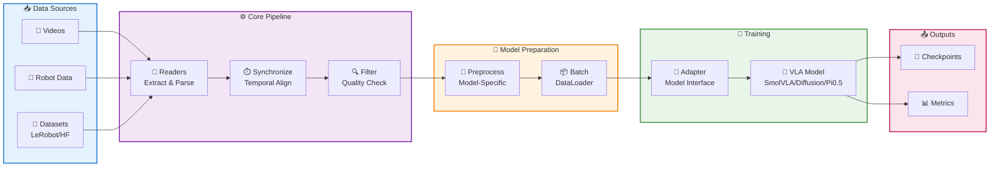

# policy_loom

Open-source toolkit for building, preprocessing, and training Vision-Language-Action (VLA) models for robotics.

## Architecture Overview



## Installation

### Base Installation

```bash
# Clone repository
git clone https://github.com/advaita-labs/policy_loom.git
cd policy_loom

# Install base package
uv sync
```

### Model-Specific Dependencies

```bash
# For DiffusionPolicy training
uv sync --extra diffusion

# For development
uv sync --extra dev
```

## Quick Start

```python
from loom.io.synchronized import SynchronizedVideoMCAPReader
from loom.pipeline import merge_streams

# Read synchronized video frames
left_cam = SynchronizedVideoMCAPReader(
    video_path="left_cam.mp4",
    mcap_path="data.mcap",
    camera_topic="left_arm/perception_interface/left_cam/state",
    camera_name="left_cam"
)

right_cam = SynchronizedVideoMCAPReader(
    video_path="right_cam.mp4",
    mcap_path="data.mcap",
    camera_topic="right_arm/perception_interface/right_cam/state",
    camera_name="right_cam"
)

# Merge multi-camera streams
for sample in merge_streams(left_cam, right_cam, time_tolerance=0.033):
    # sample.timestamp: absolute Unix timestamp
    # sample.cameras: list of CameraImage objects
    # sample.proprio: robot joint state (if available)
    # sample.action: robot action (if available)
    pass
```

## Folder Structure

```
policy_loom/
├── src/
│   ├── loom/                 # Main package (import as: from loom...)
│   │   ├── core/             # Core types and abstractions (Sample, Reader, Transform)
│   │   ├── io/               # Data readers
│   │   │   ├── mp4/          # Video reader (MP4Reader)
│   │   │   ├── mcap/         # Robot telemetry reader (MCAPReader)
│   │   │   └── synchronized.py  # Synchronized video+MCAP reader
│   │   ├── pipeline/         # Data merging and processing (merge_streams)
│   │   ├── preprocessing/    # Model-specific preprocessing
│   │   ├── training/         # Training adapters and utilities
│   │   └── observability/    # Logging and monitoring
│   └── policy_loom/          # Distribution package (placeholder)
├── tests/                    # Test suite
├── scripts/                  # Utility scripts
├── docs/                     # Documentation
└── configs/                  # Configuration files
```

**Note on package naming:**
- **Distribution name**: `policy-loom` (with hyphen, used in `pip install policy-loom`)
- **Import name**: `loom` (the actual Python package, used in `from loom import ...`)
- **policy_loom folder**: Placeholder for distribution metadata, use `loom` for all imports

## Code Flow

### 1. Data Ingestion (Readers)

```
Video Files (MP4) ──────┐
                        ├──> merge_streams() ──> Synchronized Samples
Robot Telemetry (MCAP) ─┘
```

**Readers** convert raw data to `Sample` objects:
- `MP4Reader`: Extract RGB frames from video
- `MCAPReader`: Read proprio/action data from MCAP
- `SynchronizedVideoMCAPReader`: Align video frames with MCAP timestamps

### 2. Temporal Alignment (Pipeline)

`merge_streams()` uses **nearest neighbor matching** to align multi-modal data:
- Groups samples within time tolerance (default: 33ms)
- Selects temporally closest sample for proprio/action
- Combines multi-camera images into single `Sample`

### 3. Transformation (Optional)

Apply transforms to samples:
- Vision transforms: resize, normalize, augment
- Time transforms: resampling, filtering

### 4. Preprocessing (Model-Specific)

Convert samples to model input format:
- Vision preprocessing: resize, normalize, tokenize
- Action space handling: normalization, clipping
- Batching and collation for PyTorch DataLoader

## Design Principles

### 1. Hexagonal Architecture (Ports & Adapters)

Core abstractions are defined as protocols:
- **Reader**: Input data sources
- **Transform**: Stateless data transformations
- **Preprocessor**: Model-specific preprocessing and batching

This allows easy extension without modifying core logic.

### 2. Temporal Correctness First

VLA training requires precise temporal alignment:
- **Nearest neighbor matching** for discrete robot states
- **Ground truth timestamps** from MCAP camera messages
- **No interpolation** for actions (discrete, cannot interpolate)

### 3. Dataclass-First Design

Use dataclasses over dicts for type safety:
- `Sample`: canonical data container
- `CameraImage`: multi-camera support
- Configuration objects use dataclasses

### 4. Test-Driven Development

All critical features have tests:
- Unit tests for readers, transforms, pipeline
- Integration tests for full workflows
- >75% code coverage target

### 5. Simplicity Over Abstraction

Code should be self-explanatory:
- Minimal documentation (only for breaking decisions)
- Prefer explicit over clever
- No premature optimization

## Running Tests

```bash
# Run all tests
uv run pytest -v

# Run with coverage
uv run pytest --cov=loom --cov-report=term-missing

# Run specific test
uv run pytest tests/test_pipeline.py::TestMergeStreams::test_merge_multiple_proprio_uses_nearest -v
```

## Development

```bash
# Run linters
black src/ tests/
isort src/ tests/
ruff check src/ tests/

# Type checking
mypy src/
```

## License

MIT
